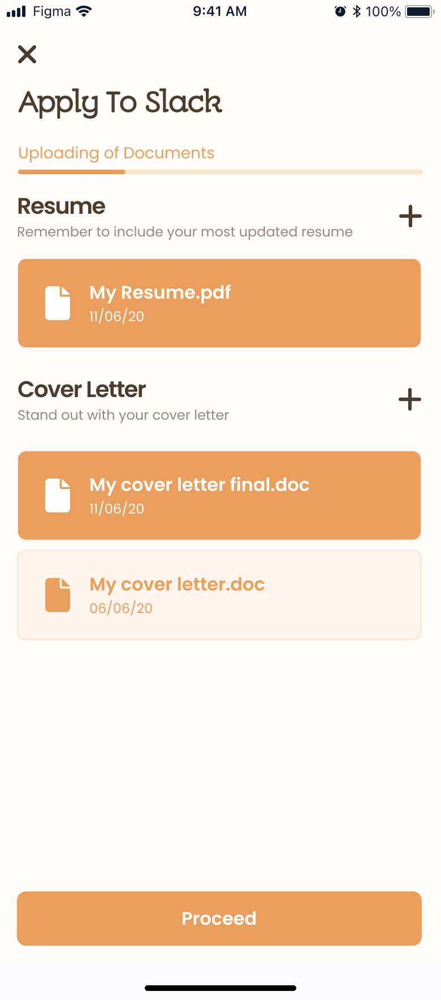
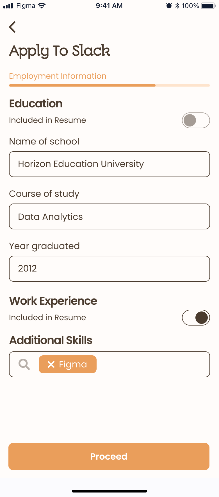

# Job Box

A simple Flutter project for job listings with login, job browsing, job details, applying for jobs, and user profile screens. Uses **BLoC** for state management and **Dio** for fetching dummy API data.

---

### UI Design

<div style="display: flex; overflow-x: auto; gap: 15px; padding: 15px;">
  
  
  
  
  
  
  
  
  
</div>


---

## Getting Started

```bash
git clone https://github.com/MiThaikKaMar/job_box.git
cd job_box
flutter pub get
flutter run
